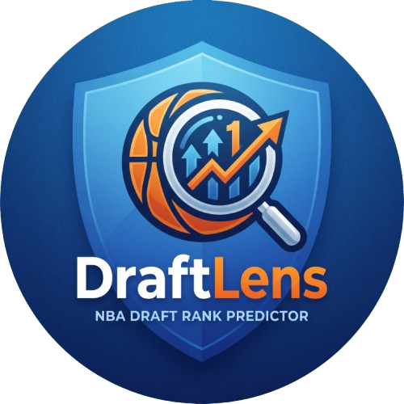
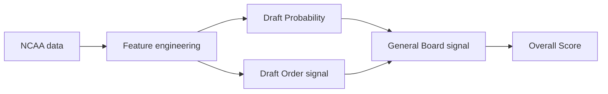

<p align="center">
  
</p>

<h1 align="center">DraftLens</h1>

<p align="center">
  <strong>Pre-draft analytics for smarter NBA Draft decisions.</strong>
</p>

<p align="center">
  An explainable analytics tool for ranking NCAA prospects, understanding team fit,
  finding NBA statistical comparables, and analysing custom draft classes.
</p>

<p align="center">
  Built for the <strong>AQX Sports Analytics Data Bowl 3.0</strong>.
</p>

<p align="center">
  <a href="LICENSE"></a>
</p>

---

## Short project description

**DraftLens turns NCAA pre-draft data into an independent and explainable NBA Draft board.**

Instead of reproducing public mock drafts, DraftLens evaluates prospects from their statistical profile. It combines a **Draft Probability** model with a **Draft Order signal**, then turns them into a class-relative **Overall Score**.

The product goes beyond a ranking: users can inspect what drives each prospect's profile, compare players against NCAA peers, evaluate fit for different team needs, explore raw statistics, and find NBA players with similar statistical profiles.

DraftLens also includes a **Dataset Lab** where analysts can import their own NCAA prospect class in Excel or JSON and run the same compatible analyses directly in the browser.

**Actionable impact:** DraftLens helps analysts move from a large pool of prospects to a smaller set of players worth investigating, understand *why* a player stands out, identify statistical outliers that consensus may overlook, and adapt the analysis to a team's basketball needs.

---

## The idea

NBA Draft decisions combine many sources of information: scouting, film, interviews, medical evaluations, workouts, team strategy and statistics.

DraftLens focuses deliberately on one of them:

> **What does the pre-draft statistical record say on its own?**

That makes DraftLens useful as a second opinion.

It does not try to replace scouts or predict what a team will actually do. It provides a consistent statistical signal that can confirm a scouting view, challenge it, or surface a prospect worth another look.

---

## What you can do

| Feature | What it answers |
| --- | --- |
| **General Board** | Which prospects are most supported by the DraftLens statistical signal? |
| **Prospect Profiles** | What actually drives a player's ranking? |
| **Stats Explorer** | Who leads the class in specific NCAA statistics? |
| **Team Need** | Which prospects best fit a particular basketball profile? |
| **NBA Comparables** | Which NBA players have the closest statistical profile at a plausible height? |
| **Dataset Lab** | What happens when I run DraftLens on my own NCAA prospect class? |

---

## General Board

The General Board combines two complementary models.

**Draft Probability** estimates how likely a declared NCAA early entrant is to be drafted based on his pre-draft statistical profile.

**Draft Order** estimates where the statistical profile of a drafted prospect tends to sit within a draft. Because predicting a literal pick is too noisy, DraftLens uses this as an ordering signal rather than displaying it as a predicted pick.

They are combined into:

**Board Signal = P(drafted) × (S + 1 − clip(p̂, 1, S)) / S**

where:

- **S** is the draft size;
- **p̂** is the Draft Order model output;
- **clip(p̂, 1, S)** constrains that output to the valid draft range.

The final **Overall Score** is the prospect's percentile on that signal within the analysed class, mapped from 0 to 100.

> **Overall Score is a ranking score, not a probability and not a predicted draft pick.**

---

## Prospect Profiles

A ranking is more useful when you can understand it.

Each prospect page includes:

- NCAA production and efficiency statistics
- a six-dimension Basketball Profile
- Key Strengths backed by the underlying statistics
- Areas to Watch
- Team Need fit
- NBA Statistical Comparables

The goal is to make the model inspectable instead of asking users to trust a single number.

---

## Team Need

A universal ranking does not answer every front-office question.

DraftLens therefore scores prospects against six basketball profiles:

- **Shooter**
- **Slasher / Rim Attacker**
- **Playmaker**
- **3&D Wing**
- **Rim Protector**
- **Stretch Big**

Users can also create a **Custom Need** by adjusting the importance of Shooting, Playmaking, Defensive Production, Rebounding and Size.

The result is a separate Fit Score based on how well the prospect's NCAA profile matches that basketball need.

---

## NBA Statistical Comparables

DraftLens searches a frozen NBA reference pool for players with similar statistical profiles.

The comparison follows two steps:

prospect
↓
height plausibility gate
↓
six-dimensional statistical similarity
↓
3 NBA comparables

Height is only used to prevent physically implausible comparisons. It is **not** part of the statistical distance itself.

The similarity space covers:

- Shooting Efficiency
- Scoring Role
- Creation
- Rebounding
- Defensive Activity
- Perimeter Orientation

NBA comparables are **descriptive similarities, not career projections**.

---

## Dataset Lab

DraftLens is not limited to the built-in class.

Users can open **Analyze Data** and import their own NCAA prospect dataset as:

- Excel (`.xlsx` / `.xls`)
- JSON (`.json`)

The file is validated against **DraftLens Dataset Format v1** before any analysis is performed.

Depending on what the dataset supports, DraftLens can make available:

| Analysis | Requirement |
| --- | --- |
| Stats Explorer | Valid NCAA season totals |
| Basketball Profile & Team Need | Supported NCAA reference season |
| NBA Comparables | Compatible statistics + player height |
| General Board | Compatible NCAA early-entry population + complete model requirements |

DraftLens does not invent missing capabilities. If a dataset cannot support an analysis, the interface explains why instead of producing a misleading score.

### Private by design

Dataset Lab runs **entirely in the browser**.

Your file is not uploaded, there is no DraftLens backend, and no database stores the dataset.

Close the tab and the imported session disappears.

---

## How DraftLens works



Alongside the Board pipeline, the same statistical foundation powers Team Need profiles, Stats Explorer and NBA Comparables.

---

## Methodology

DraftLens was designed around one important constraint:

**evaluate future draft classes using only information that would have been available before those drafts.**

The main development population contains **887 declared NCAA early entrants from 2014–2025**:

| Population | Prospects |
| --- | ---: |
| Drafted | 431 |
| Undrafted | 456 |
| **Total** | **887** |

An earlier **2011–2013** sample is used as an additional robustness window.

Validation is performed with **forward-in-time splits**, not a random train/test split. Earlier draft classes train the system; later classes evaluate it.

### Draft Probability

Logistic Regression with balanced class weights and season-relative NCAA features.

### Draft Order

Ridge Regression trained only on historically drafted prospects.

The raw pick estimate is not presented to users because the model is much more useful as an ordering signal than as a literal pick prediction.

Full methodology: **[docs/METHODOLOGY.md](docs/METHODOLOGY.md)**

---

## Validation

Historical out-of-fold performance:

| Component | Metric | Result |
| --- | --- | ---: |
| Draft Probability | Macro AUC | **0.6986** |
| Draft Probability | Pooled AUC | **0.6953** |
| Draft Probability | Brier Score | **0.2238** |
| Draft Order | Spearman | **0.2968** |
| Draft Order | Kendall | **0.2089** |
| Draft Order | NDCG | **0.9043** |
| Draft Order | NDCG@14 | **0.7555** |
| General Board | Binary AUC | **0.7123** |
| General Board | Graded NDCG | **0.8283** |
| General Board | Drafted-only Spearman | **0.2781** |

These results are why DraftLens is positioned as a **decision-support system**, not an automated scouting verdict.

### 2026 replay

The methodology was frozen before the 2026 evaluation and prospect-level predictions were generated and hashed before individual outcomes were opened. No post-holdout tuning was performed.

For transparency, one aggregate diagnostic statistic relating to a broader 2026 population was accidentally seen while sourcing a structural draft parameter before prediction generation. No prospect-level outcome labels were exposed and the information was not consumed by the prediction pipeline.

For that reason, DraftLens does **not** describe the replay as a perfectly sealed zero-information holdout.

Full validation record: **[docs/VALIDATION.md](docs/VALIDATION.md)**

---

## Browser ↔ Python parity

Dataset Lab reproduces the frozen Python analytics directly in TypeScript.

Before shipping the feature, the complete known 2026 class was processed through both implementations.

The maximum numerical discrepancy across continuous outputs was **below `1e-12`**, while:

- Board ranks matched exactly
- Overall Scores matched exactly
- Team Need Fit Scores matched exactly
- eligibility states matched exactly
- NBA comparable identities matched exactly

The browser therefore runs the same analytical logic rather than an approximate frontend recreation.

---

## Tech stack

| Layer | Technology |
| --- | --- |
| Analytics | Python, pandas, NumPy, SciPy, scikit-learn, PyArrow |
| Frontend | React 19, TypeScript, Vite |
| Routing | React Router |
| Styling | CSS Modules |
| Excel import | read-excel-file |
| Architecture | Static frontend + browser-local analytics |

There is **no backend and no database**.

---

## Project structure

```text
src/
├── data/          NCAA/NBA data acquisition and identity resolution
├── features/      feature engineering
├── board/         Draft Probability, Draft Order and General Board
├── team_need/     Team Need scoring
├── comparables/   NBA Statistical Comparables
├── dataset_format.py
└── runtime_bundle.py

app/               React application
config/            frozen analytical configuration
docs/              methodology, validation and data documentation
scripts/           acquisition, build, validation and demo commands
tests/             unit, integration and parity tests
```

---

## Run locally

The frontend can run directly from the committed product artifacts.

```bash
git clone https://github.com/JuriSOK/DraftLens.git
cd DraftLens/app

npm install
npm run dev
```

Production build:

```bash
npm run build
```

For analytics development:

```bash
cd DraftLens

python -m venv .venv
source .venv/bin/activate
pip install -e .

python -m unittest discover -s tests -t .
python scripts/validate.py
node app/tests/parity.mjs
```

---

## Bring your own dataset

The **Analyze Data** page provides ready-to-use Excel and JSON templates for **DraftLens Dataset Format v1**.

A dataset contains:

- class metadata
- prospect identity
- NCAA season totals
- optional team context
- optional shot-profile data
- physical measurements where available

DraftLens derives rates and percentages from season totals rather than asking users to provide ambiguous precomputed percentages.

The full schema, units and required fields are available directly inside the Dataset Lab.

---

## Data sources

| Source | Usage |
| --- | --- |
| sportsdataverse / hoopR NCAA | NCAA box scores and shot events |
| sportsdataverse / hoopR NBA | NBA statistical reference pool |
| Wikipedia / MediaWiki | NCAA early-entry populations and historical draft results |
| Wikidata | Display-only biographical information |
| ESPN athlete metadata | NBA heights used by the comparable plausibility gate |

Full provenance and acquisition details: **[docs/DATA.md](docs/DATA.md)**

---

## Scope & limitations

DraftLens intentionally focuses on what can be measured from available pre-draft data.

It does not include interviews, medical evaluations, private scouting reports or workouts. Defensive analysis relies on measurable production such as steals and blocks rather than claiming to capture total defensive value. NBA comparables describe statistical resemblance, not future careers.

Draft Probability is validated specifically on declared NCAA early entrants, so Dataset Lab only exposes the full Board when the uploaded population is methodologically compatible.

DraftLens should therefore be used as **one structured analytical input in a broader scouting process**.

---

## License

DraftLens's own code is released under the **[MIT License](LICENSE)**. The
underlying NCAA/NBA data keeps its own source licences (CC BY / CC BY-SA /
CC0) — see [Data sources](#data-sources) — which the MIT grant does not
extend to.

---

## Hackathon

DraftLens was built for the **AQX Sports Analytics Data Bowl 3.0**.

The project combines:

**sports analytics · machine learning · explainability · product design · browser-local data analysis**

with one goal:

> **Turn pre-draft NCAA data into an independent signal that helps people decide where to look next.**
