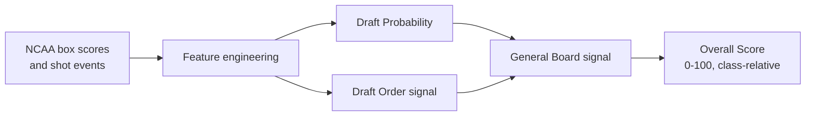
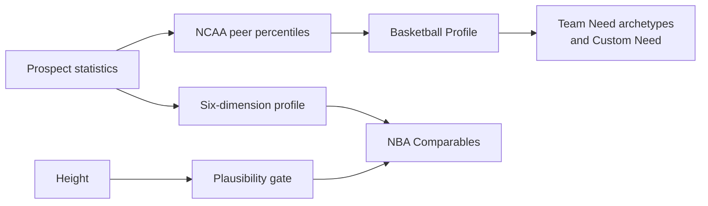

<p align="center">
  
</p>

<h1 align="center">DraftLens</h1>

<p align="center">
  <strong>Pre-draft analytics for smarter NBA Draft decisions.</strong>
</p>

<p align="center">
  An independent statistical read on NCAA prospects — every score traced back
  to a box-score input, and validated forwards through time.
</p>

<p align="center">
  Built for the <strong>AQX Sports Analytics Data Bowl 3.0</strong>.
</p>

---

## What is DraftLens?

DraftLens is a pre-draft decision-support tool built on NCAA prospect data. It
is not a mock draft and it does not try to reproduce one. Mock drafts already
aggregate reporting and team intent; DraftLens answers a narrower, checkable
question from the statistical record alone:

> Among declared NCAA early entrants, which prospects does the pre-draft
> record support, and how strongly?

That independence is the point. A signal built only from production is useful
precisely because it disagrees with consensus sometimes, and when it does you
can open the profile and see exactly which statistics drove it.

It helps you rank prospects, inspect statistical profiles, compare players
against their NCAA peers, evaluate fit against a specific team need, explore
raw statistics, find NBA statistical comparables, and analyse your own NCAA
dataset.

DraftLens complements scouting. It has no access to interviews, medicals,
workouts or private information, and it is designed to be one input among
several rather than a verdict.

## Why DraftLens?

- **Traceable.** Every number resolves to a statistic you can inspect on the
  prospect's page. Nothing is a black box score.
- **Honest about uncertainty.** Draft Probability is a probability. Overall
  Score is a ranking score. The Draft Order model's raw pick estimate is never
  shown as a pick, because its error is 13 picks wide.
- **Validated the way a draft happens.** Training on earlier classes,
  evaluating on a later unseen one — never a random split.
- **Refuses rather than guesses.** Where the data or the population cannot
  support an analysis, DraftLens says so instead of producing a
  plausible-looking number.

## Features

### General Board

A ranking of declared NCAA early entrants, built from two frozen signals:

| Signal | What it is |
| --- | --- |
| **Draft Probability** | P(drafted) for a declared early entrant. A real probability. |
| **Draft Order signal** | Among drafted profiles, how early a profile resembles being taken. Used as a ranking-quality signal only. |
| **General Board signal** | The two combined into one board ordering. |
| **Overall Score** | The board signal expressed 0–100 *within its own class*. |

**Overall Score is not a probability**, and DraftLens does not predict the
actual draft order. A score of 90 means "this profile ranks in the 90th
percentile of this class on the board signal" — nothing about a specific pick.

### Prospect profiles

Each prospect page carries core NCAA statistics, a six-dimension **Basketball
Profile** on an NCAA peer-percentile scale, **Key Strengths** and **Areas to
Watch** with the statistics behind each one, **Team Need fit** across six
archetypes, and **NBA Statistical Comparables**.

### Stats Explorer

Rank the class directly by NCAA production — scoring, rebounding, playmaking,
defensive production, shooting — with distributions and thin-sample flags.

### Team Need

Six predefined archetypes: **Shooter**, **Slasher / Rim Attacker**,
**Playmaker**, **3&D Wing**, **Rim Protector**, **Stretch Big**. Conjunctive
archetypes use a geometric mean, so a prospect elite at one pillar and poor at
another does not average into a good fit.

**Custom Need** lets you weight the dimensions yourself. If too much of the
requested weight lands on a dimension a prospect has no data for, the fit is
reported unavailable rather than computed from a fraction of the request.

### NBA Statistical Comparables

```
prospect → height plausibility gate → six-dimension similarity → 3 NBA players
```

Height gates *which* NBA players are eligible to be compared against; it never
enters the similarity itself. The six dimensions are role and style axes
(scoring role, creation, rebounding, defensive activity, perimeter
orientation, shooting efficiency), compared as percentiles within each league
so NCAA and NBA production are never compared directly.

**Comparables are descriptive statistical resemblance, not career
projections.**

### Dataset Lab

Bring your own class. Upload an **Excel (.xlsx / .xls)** or **JSON (.json)**
file and DraftLens runs the same frozen analyses on it.

**The analysis runs entirely in your browser.** The file is parsed locally,
nothing is uploaded, and there is no server to upload it to.

What you get back depends on what your data can support:

| Analysis | Requires |
| --- | --- |
| Stats Explorer | Season totals |
| Basketball Profile & Team Need | A season DraftLens holds NCAA peer references for |
| NBA Comparables | The above, plus player heights |
| General Board | The above, plus a declared early-entry population and a draft size |

Not every dataset receives every analysis. Each one that is unavailable is
listed with the reason — a file that is not a declared early-entry population
receives **no Draft Probability at all**, because that is the only population
the model was validated on.

## How it works





## Methodology

Full detail lives in **[docs/METHODOLOGY.md](docs/METHODOLOGY.md)**. The short
version:

**Populations.** The development window is **2014–2025**: 887 declared NCAA
early entrants, 431 drafted and 456 undrafted. **2011–2013** (125 prospects)
is held aside as a robustness window. The **2026** class was a one-time
holdout, scored once with the frozen system on its 26 final NCAA early
entrants.

**Temporal validation, never a random split.** Seven forward-in-time folds
train on earlier classes and evaluate on the next unseen one. A random split
would let a later draft class inform an earlier prediction, which is not a
situation that exists when you are actually evaluating a draft.

**Draft Probability.** Logistic regression with balanced class weights, on a
season-relative feature representation — each prospect's production is
expressed against the full NCAA population of *their own season and position*,
so a 19-point season in a low-scoring year is not compared naively against a
high-scoring one.

**Draft Order.** Ridge regression trained **only on historically drafted
prospects**. Its raw output is a predicted pick, but the model's error is 13.2
picks on a 60-pick draft, so that number is never shown. It is used as an
ordering signal — "if this profile were draftable, which part of the draft
does it resemble?"

**General Board.** The two signals combine multiplicatively, as an
expectation: probability of being drafted, times the quality of the slot the
profile resembles.

$$
\text{board signal} = P(\text{drafted}) \times \frac{S + 1 - \mathrm{clip}(\hat{p},\, 1,\, S)}{S}
$$

where $S$ is the draft size and $\hat{p}$ the Draft Order model's predicted
pick, clipped into the legal slot range. **Overall Score** is the percentile
rank of that signal within the class, mapped to 0–100.

**Missing data is never zero.** An absent measurement is treated as absent —
imputed by the frozen training median for the model, or dropped from a
dimension which then renormalises. Filling gaps with zero would make
missingness itself a signal, and missing-data rows were disproportionately
undrafted historically.

## Validation

Full evidence in **[docs/VALIDATION.md](docs/VALIDATION.md)**. Historical
out-of-fold results across 2019–2025:

| Draft Probability | | Draft Order | | General Board | |
| --- | --- | --- | --- | --- | --- |
| Macro AUC | 0.6986 | Macro Spearman | 0.2968 | Binary AUC | 0.7123 |
| Pooled AUC | 0.6953 | Macro Kendall | 0.2089 | Graded NDCG | 0.8283 |
| Brier | 0.2238 | Macro NDCG | 0.9043 | Drafted-only Spearman | 0.2781 |
| | | NDCG@14 | 0.7555 | | |
| | | MAE / RMSE | 13.21 / 15.56 picks | | |

These are honest numbers for a box-score-only model, and they are why the
product is framed as decision support. An AUC near 0.70 separates drafted from
undrafted prospects meaningfully but not decisively — which is the correct
expectation when interviews, medicals and workouts are absent from the data.

### The 2026 replay

The methodology was frozen and committed **before** any 2026 outcome was
opened. Predictions were generated and hashed first, and the outcomes were
unsealed only to evaluate them. No model, hyperparameter, feature, formula or
score was changed afterwards.

One disclosure, because the audit trail matters more than a clean story: while
sourcing the draft size — a structural fact about the draft, not a player
outcome — an aggregate diagnostic row for 2026 was incidentally seen before
the freeze. It described a different, broader population than the one this
replay scores, no code path consumed it, and no prospect-level outcome label
was exposed before predictions were generated and hashed. This is recorded in
full in [docs/VALIDATION.md](docs/VALIDATION.md). It is not a perfectly sealed
zero-information holdout, and DraftLens does not claim one.

### Dataset Lab parity

The Dataset Lab runs the frozen models in the browser, so those models have to
give the same answers there as in Python. Before the feature shipped, the
known 2026 inputs were run through the browser runtime and compared against
the Python system for every prospect:

- Maximum numerical discrepancy across all continuous outputs: **< 1e-12**
- **Exactly equal**: board rank, Overall Score, Fit Score, eligibility states,
  and NBA comparable identities

The parity harness is a release gate — if it fails, the browser board does not
ship.

## Tech stack

**Frontend** — React 19, TypeScript, Vite, React Router, CSS Modules.
Excel parsing via [`read-excel-file`](https://www.npmjs.com/package/read-excel-file),
loaded on demand.

**Analytics** — Python with pandas, pyarrow, numpy, scipy and scikit-learn.

**Architecture** — a static frontend with a browser-local Dataset Lab. **No
backend, no database, no user accounts.** The Python pipeline produces
immutable artifacts; the app reads them.

## Project structure

```
src/
  data/          acquisition, identity resolution, dataset build
  features/      basketball formulas + feature engineering
  board/         Draft Probability, Draft Order, General Board
  team_need/     six-dimension peer-percentile fit scoring
  comparables/   NBA statistical comparables
  dataset_format.py   DraftLens Dataset Format v1
  runtime_bundle.py   frozen models serialised for the browser

scripts/         acquire.py · build.py · validate.py · demo.py
config/          board.json · team_need.json · comparables.json
docs/            DATA.md · METHODOLOGY.md · VALIDATION.md
app/             React frontend
tests/           unit + integration + parity fixtures
```

## Run locally

The frontend reads committed data artifacts, so it runs without the Python
pipeline.

```bash
git clone https://github.com/JuriSOK/DraftLens.git
cd DraftLens/app
npm install
npm run dev
```

Other frontend commands:

```bash
npm run build     # typecheck + production build
npm run preview   # serve the production build
npm run lint
```

### Working on the analytics

The Python side is only needed to rebuild artifacts.

```bash
python -m venv .venv && source .venv/bin/activate
pip install -e .

python -m unittest discover -s tests -t .   # test suite
python scripts/validate.py                  # leakage + contract validation
node app/tests/parity.mjs                   # browser/Python parity
```

Rebuilding artifacts (raw data is not committed; see
[docs/DATA.md](docs/DATA.md) for acquisition):

```bash
python scripts/build.py             # dataset → features → references
python scripts/build.py app-data    # the app's product data
python scripts/build.py app-runtime # browser runtime bundle + templates
```

## Dataset Lab format

Imported files follow **DraftLens Dataset Format v1**:

- **Metadata** — `dataset_name`, `season`, `population_type`, `draft_size`
- **Prospects** — identity, NCAA season totals, and optionally team context,
  shot-profile counts, height and weight

Every input is a season **total** or a physical measurement. DraftLens derives
each percentage itself, which is why there is no question of whether `41.2`
means 41.2% or 0.412 — a percentage is never an input.

**Use the templates rather than rebuilding the schema by hand.** The Analyze
Data page offers downloadable **JSON and Excel templates** plus a full column
reference with types, units and required/optional status.

## Limitations

These are scope boundaries, and stating them is part of the design.

- DraftLens is a **statistical model, not a scouting replacement**. It has no
  interviews, medicals, workouts, or private scouting information.
- **Defensive evaluation uses box-score proxies** (steals, blocks). That is
  production, not defensive quality, and it is labelled that way everywhere it
  appears.
- **NBA comparables are descriptive**, not career forecasts.
- **Draft Probability is validated on declared NCAA early entrants.** Applied
  to another population it would not mean what it says, which is why the
  Dataset Lab withholds it for incompatible files.
- **Unsupported seasons receive reduced analysis.** No neighbouring season's
  distribution is substituted.
- **Dataset Lab sessions are memory-only** and are lost on refresh.
- Outputs are **decision-support signals**, not predictions of what a team
  will do.

## Privacy

Dataset Lab files are parsed and analysed **locally in your browser**.
DraftLens does not upload your dataset anywhere, stores nothing, and uses no
database. Closing the tab ends the session.

## Data sources

| Source | Used for | Licence |
| --- | --- | --- |
| [hoopR-mbb-data](https://github.com/sportsdataverse/hoopR-mbb-data) (sportsdataverse, upstream ESPN) | NCAA box scores and shot events, 2011–2026 | CC BY 4.0 |
| [hoopR-nba-data](https://github.com/sportsdataverse/hoopR-nba-data) (sportsdataverse, upstream ESPN) | NBA player season statistics | CC BY 4.0 |
| English Wikipedia "*year* NBA draft" articles | Declared early-entrant population, draft results, college affiliation | CC BY-SA 4.0 |
| Wikidata | Date of birth, display only | CC0 1.0 |
| ESPN athlete endpoint | NBA heights for the comparables plausibility gate | — |

Full provenance, source hazards and identity-resolution notes are in
[docs/DATA.md](docs/DATA.md).

## Hackathon note

Built for the **AQX Sports Analytics Data Bowl 3.0**. The analytical
methodology is frozen: `docs/METHODOLOGY.md` records what each system does and
why, `docs/VALIDATION.md` is the evidence behind every number here, and the
frozen anchors are asserted by the test suite.
